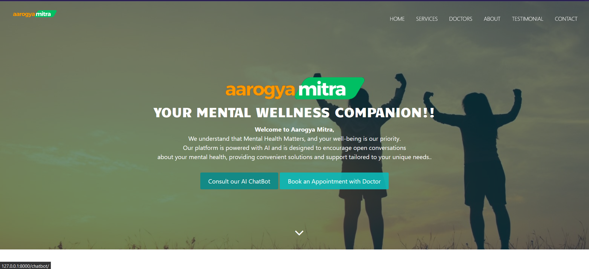

### AarogyaMitra💖

AarogyaMitra is platform that connects you with trained and compassionate chatbots that can provide you with emotional support, guidance, and resources.

See it in action - https://aarogyamitra.pythonanywhere.com/
 
ArogyaMitra is a diagonostic management project developed in django. Admin can add doctor, User can see doctors profile and also they can make appointment. 
They can also contact to the HealthCare through email.



### Setup, Installation and Run

To run the app on your local machine, you need Python 3+, installed on your computer. Follow all the steps to run this project.

1.  Create virtual environment:
```bash
virtualenv env
```
    
2.  Activate virtual environment:
```bash
On Linux or Git Bash - source env/bin/activate
On Windows - env/Scripts/activate
```

3. Firstly you need to clone or download my project from github repositories:
```bash
git clone https://github.com/satvikx/AarogyaMitra.git
```

4. Then enter the corresponding directory:
```bash
cd AarogyaMitra
```
5. Install dependencies
```bash
  pip install -r requirements.txt
``` 
6. Create a .env file in the base directory ArogyaMitra/..(here)
```bash
  SECRET_KEY=YOUR_SECRET_KEY
``` 
7. Run local server, and DONE!
```python
  python manage.py runserver
```

8. Then go to ```http://127.0.0.1:8000``` in your browser.

### To create superuser open terminal and type:
```
python manage.py createsuperuser
```
### For email sending functionality fill up the information in Your Project setting (optional)
```
EMAIL_BACKEND = 'django.core.mail.backends.smtp.EmailBackend'
EMAIL_HOST = 'smtp.gmail.com'
EMAIL_PORT = 587
EMAIL_USE_TLS = True
EMAIL_HOST_USER = 'your email'
EMAIL_HOST_PASSWORD = 'your email password'
```

With 💖 by
Satvik Shrivastava
